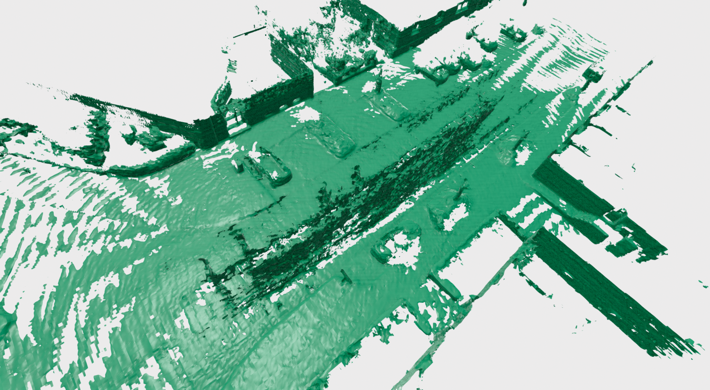

# Voxblox Python Bindings

This small library provides python Bindings for the
[Voxblox](https://voxblox.readthedocs.io/en/latest/index.html) library[^fn]. The original code has
not been modified at all(even more, it's just a hard dependency of this project) and it's only
exposing some itegration methods(for `TSDF` reconstruction) in Python, this make experimentation
much easier than relying on the full ROS ecosystem and bagfiles.

[^fn]: All voxblox documentation can be found on [the original readthedocs page](https://voxblox.readthedocs.io/en/latest/index.html)

## Example results



In case you wonder why that weird wall is on the output mesh, that's an already [known
bug](https://github.com/ethz-asl/voxblox/issues/373) of the original voxblox library... I'm sorry,
it's not because of the python bindings.

## Installation

### Dependencies

The only dependencies for this library it's a propper C++ compiler, if you are using ubuntu-based distribution this command will give you all the necessary dependencies:

#### C++ dependencies

```sh
sudo apt-get update && apt-get install build-essential cmake libprotobuf-dev protobuf-compiler
```

#### Python dependencies

```sh
sudo apt-get update && apt-get install python3 python3-dev python3-pip
```

### Installing the python bindings

Just clone this repo:

```sh
git clone --recurse-submodules https://https://github.com/PRBonn/voxblox_pybind
```

And install the python bindings:

```sh
cd voxblox_pybind
make install
```

## Usage

The only classes that are exposed through the Python API are:

- [FastTsdfIntegrator](https://voxblox.readthedocs.io/en/latest/api/classvoxblox_1_1FastTsdfIntegrator.html)
- [MergedTsdfIntegrator](https://voxblox.readthedocs.io/en/latest/api/classvoxblox_1_1MergedTsdfIntegrator.html)
- [SimpleTsdfIntegrator](https://voxblox.readthedocs.io/en/latest/api/classvoxblox_1_1SimpleTsdfIntegrator.html)

Considering that you have already a `dataset` that provide you with pointclouds, the usage of the python bindings are quite straight forward:

```python
# It's your responsability to provide this dataset implementation
dataset = SimpleDataset()

# Pick some parameters
voxel_size = 0.1
sdf_trunc = 3 * voxel_size

# Run fusion pipeline
tsdf_volume = SimpleTsdfIntegrator(voxel_size, sdf_trunc)
for idx in range(len(dataset)):
    scan, pose = dataset[idx]
    tsdf_volume.integrate(scan, pose)

# Get the output mesh
vertices, triangles = tsdf_volume.extract_triangle_mesh()
mesh = o3d.geometry.TriangleMesh(
    o3d.utility.Vector3dVector(vertices),
    o3d.utility.Vector3iVector(triangles),
)
mesh.compute_vertex_normals()
o3d.visualization.draw_geometries([mesh])

```

A full self-conctained example can be found at [test_voxblox.py](apps/test_voxblox.py) and a more complete pipeline at [kitti_pipeline.py](apps/kitti_pipeline.py)

## Credits

This code has been created to support the development of
[VDBFusion](https://github.com/PRBonn/vdbfusion). If you use our code in your academic work, please
cite the corresponding paper **and** the original voxblox paper:

```latex
@article{vizzo2022sensors,
  author         = {Vizzo, Ignacio and Guadagnino, Tiziano and Behley, Jens and Stachniss, Cyrill},
  title          = {VDBFusion: Flexible and Efficient TSDF Integration of Range Sensor Data},
  journal        = {Sensors},
  volume         = {22},
  year           = {2022},
  number         = {3},
  article-number = {1296},
  url            = {https://www.mdpi.com/1424-8220/22/3/1296},
  issn           = {1424-8220},
  doi            = {10.3390/s22031296}
}
```

**Original voxblox paper:**

```latex
@inproceedings{oleynikova2017voxblox,
  author={Oleynikova, Helen and Taylor, Zachary and Fehr, Marius and Siegwart, Roland and  Nieto, Juan},
  booktitle={IEEE/RSJ International Conference on Intelligent Robots and Systems (IROS)},
  title={Voxblox: Incremental 3D Euclidean Signed Distance Fields for On-Board MAV Planning},
  year={2017}
}
```
